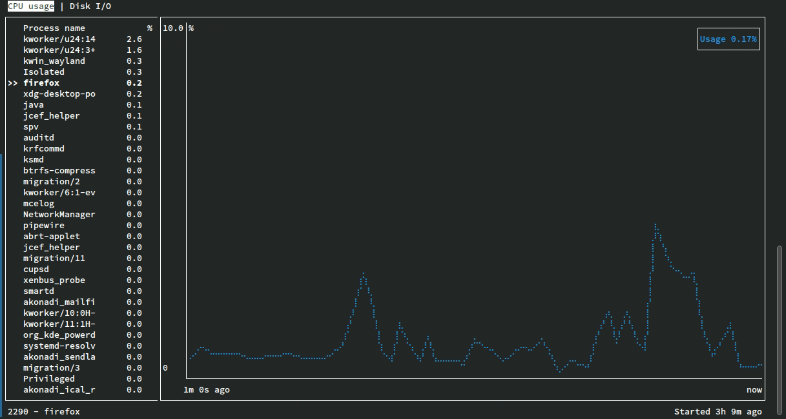

# spv

Spv is a terminal-based tool to monitor running processes.

Currently, the following process metrics can be monitored:

- CPU usage
- Disk I/O

Additional metrics should be supported in the future.
